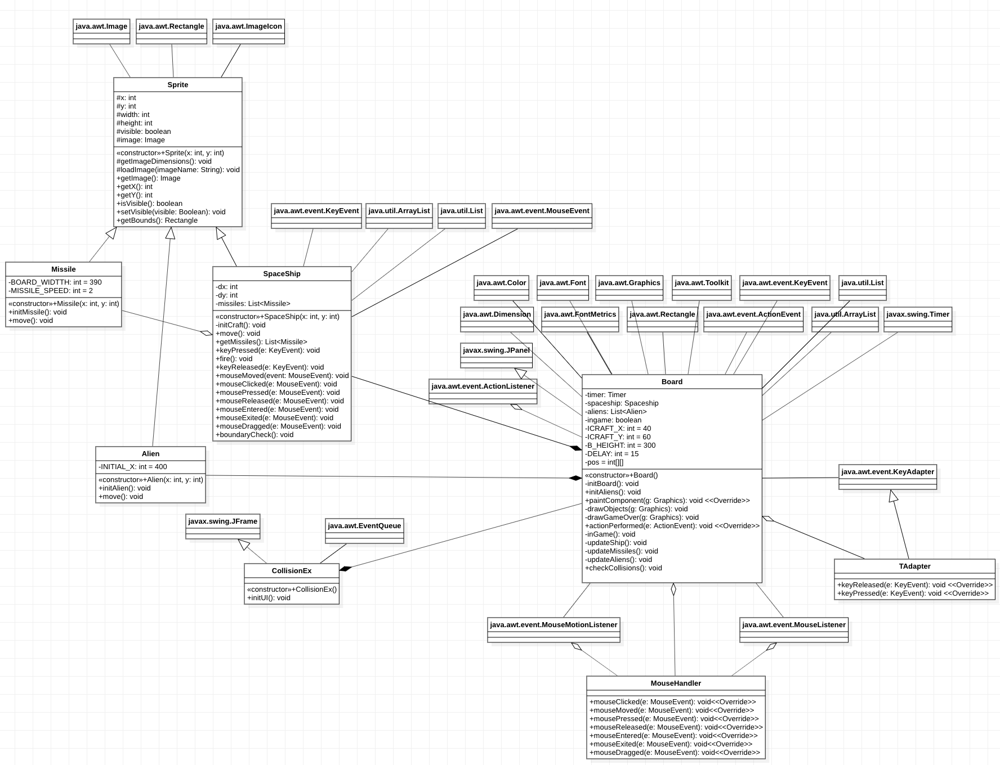

# Collision Detection

## Penjelasan Singkat

Program ini adalah sebuah program singkat yang dapat mendeteksi collision dalam sebuah permainan.

# Penjelasan Class

## Penjelasan Sprite

Kelas ini adalah bentuk kasar dari semua objek yang dapat terlihat di game tersebut. Attribute - attribute yang dimiliki oleh class ini yaitu:

- X dan Y yaitu posisi dari sprite itu sendiri.
- Width dan Height yaitu dimensi dari sprite yang akan digunakan.
- Visible yaitu terlihat atau tidak sprite tersebut.
- Image yaitu file yang akan dijadikan sprite gamenya.

Ada beberapa fungsi yang di ada di class tersebut yaitu

- Fungsi Getter
  - getImageDimensions
  - getImage
  - getX
  - getY
  - isVisible
- Fungsi Setter
  - setVisible
- Fungsi getBounds
  Fungsi ini mencari bounds dari sprite tersebut.
- Fungsi loadImage
  Fungsi ini mengload image yang akan dijadikan sprite.

Class ini juga memiliki satu constructor untuk membuat sebuah sprite.

## Penjelasan SpaceShip

Spaceship merupakan child dari Class Sprite, jadi Class SpaceShip ini mendapatkan fungsi-fungsi dan properti yang ada di Class Sprite. Di class ini ada juga properti tambahan yaitu dx dan dy, yaitu perpindahan gerak objek, dan juga missile sebagai peluru yang ditembakan.

Ada beberapa fungsi di class ini yaitu
- Fungsi Getter
  - getMissiles
- Fungsi initCraft
- Fungsi move
- Fungsi keyPressed
- Fungsi fire
- Fungsi keyReleased
- Fungsi mouseMoved
- Fungsi mouseClicked
- Fungsi mousePressed
- Fungsi mouseReleased
- Fungsi mouseEntered
- Fungsi mouseExited
- Fungsi mouseDragged
- Fungsi boundaryCheck

Perubahan dari project sebelumnya adalah dengan ditambahkannya beberapa fungsi event handler mouse seperti mouseMoved, mouseClicked, dll. Fungsi ini ditambahkan agar spaceship dapat digerakan menggunakan mouse daripada menggunakan keyboard. Selain itu semua hal yang dapat dilakukan keyboard seperti fire juga dapat dilakukan oleh mouse.

Class ini juga memiliki default constructor.

## Penjelasan Missile

Missile merupakan child dari Class Sprite juga. Pada class ini terdapat atribut BOARD_WIDTH = 390 dan MISSILE_SPEED = 2 untuk mendefinisikan lebar kotak game dan juga kecepatan tembakan peluru.

Ada beberapa fungsi di class ini yaitu
- Fungsi initMissile
- Fungsi move

Sama seperti class lainnya, class ini juga memiliki default constructor.

## Penjelasan Alien

Alien merupakan salah satu sprite game, ia memiliki attribute INITIAL_X = 400 agar alien yang sudah melewati board akan balik ke kanan board lagi.
Alien punya constructor untuk menginisialisasi objek tersebut.

- Fungsi initAlien
  Saat menginisialisasi alien dengan fungsi initAlien(), sprite alien langsung diload dari library.
- Fungsi move
  Diperuntukan untuk menggerakan alien ke kiri, dan jika alien sudah keluar dari play area, alien akan balik ke kiri dengan bantuan INITIAL_X.

## Penjelasan Board

Kelas Board ini berfungsi untuk menampung dari semua objek dari kelas-kelas yang ada. Metode di dalam kelas Board ini yang pertama ada Board() dan initBoard() untuk menginisialisasi Board. Lalu, ada initAliens() untuk menginisialisasi posisi alien, paintComponent() yang dapat menampilkan Sprite atau pesan game over, drawObjects() untuk menggambar objek yang berupa sprite. Metode-metode tersebut memerlukan pengecekan agar hanya menggambar sprite yang memang belum ada di layar melalui isVisible(). Fungsi drawGameOver() yang digunakan untuk saat pesawat bertabrakan atau alien habis. Lalu ada fungsi actionPerformed yang dimana berisi fungsi-fungsi sebagai berikut
        inGame();
        updateShip();
        updateMissiles();
        updateAliens();
        checkCollisions();
        repaint();
Setelah itu, ada fungsi updateShip() untuk menggerakkan pesawat, updateMissiles() untuk menggerakan missile, updateAliens() untuk mengecek berapa alien yang tersisa, jika masih tersisa digunakan untuk menggerakan alien. Terakhir, ada checkCollisions() yang digunakan untuk mengecek apakah pesawat akan menabrak alien, jika pesawat menabrak alien, maka game akan langsung selesai. Fungsi yang digunakan untuk memeriksa tabrakan antara alien dan pesawat adalah dengan getBounds() untuk melihat batas ujung dari objek lalu memeriksa apakah ada yang saling berpotongan menggunakan fungsi intersects(). Jika berpotongan, maka kedua objek bertabrakan, begitupun sebaliknya. checkCollisions() juga digunakan untuk missile akan mengenai alien, jika alien kena missile, maka alien akan mati, jika tidak mengenai alien, maka missile akan terus bergerak ke kanan. 

Perbedaan dari projek sebelumnya adalah dengan ditambahkannya Event Handler mouse yaitu dari interface MouseListener dan MouseMotionListener untuk membuat pergerakan spaceship, dan melakukan penembakan dengan mouse dengan cara digerakkan dan juga diclick.

link video YouTube : https://youtu.be/SE9JUzuM5dI
