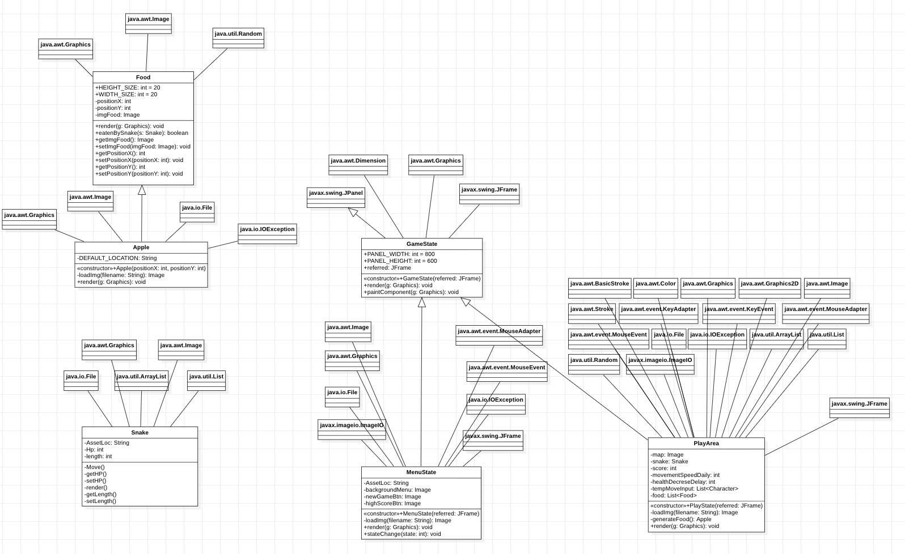

### Snake Game (WIP)

Aplikasi yang akan kami buat adalah aplikasi berbasis game, yaitu game Snake. Game Snake merupakan sebuah game dimana player mengontrol sebuah Snake, atau ular. 

Player dapat menggerakan ular ke empat arah, yaitu atas, bawah, kiri, dan kanan. Tujuan dari game ini adalah untuk mengontrol snake untuk memakan makanan yang akan muncul di board gamenya. Semakin banyak makanan yang dimakan oleh ular, maka semakin panjang juga tubuh ular akan tumbuh, lalu poin juga akan bertambah. Selain itu, ada hal yang harus dihindari oleh player, yaitu kepala ular tidak boleh menabrak badannya, jika hal ini sampai terjadi, maka ular tersebut akan mati dan akan terjadi Game Over. Saat Game Over, player akan dapat langsung melakukan restart game dengan mudah, dan state game akan kembali seperti saat awal. 

[referensi](https://www.youtube.com/watch?v=_SqnzvJuKiA&list=PLz5rnvLVJX5WPzzaJucyHujFCZNhVOivR)
