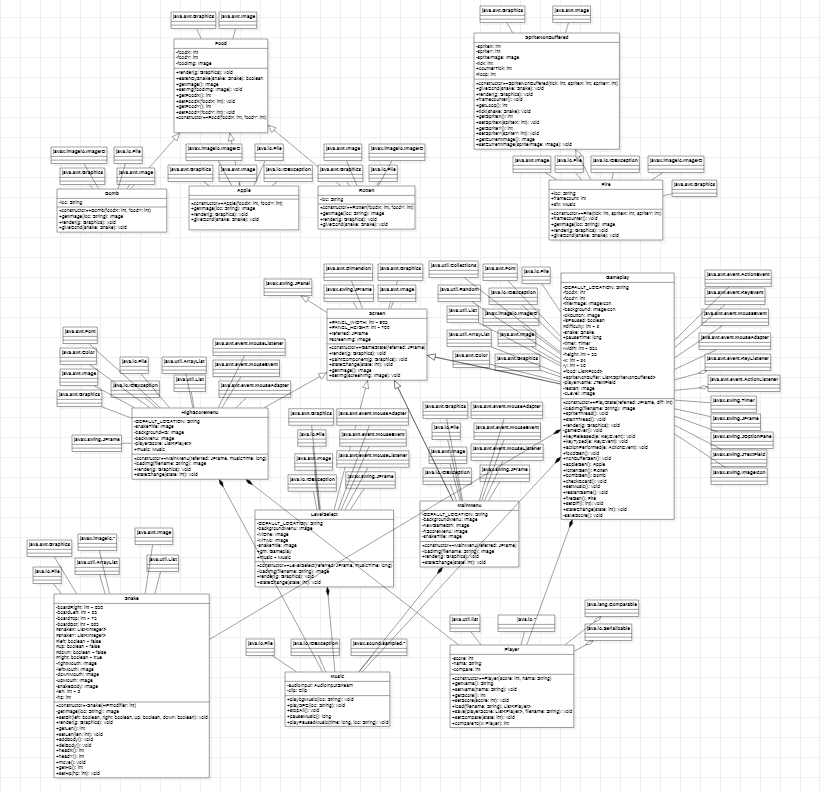

### Snake Game 

Aplikasi yang akan kami buat adalah aplikasi berbasis game, yaitu game Snake. Game Snake merupakan sebuah game dimana player mengontrol sebuah Snake, atau ular.

Seperti game Snake lainnya, player akan dapat mengontrol Snake ke empat arah, yaitu: atas, bawah, kanan, dan kiri. Objektif dari game ini adalah memakan apel sebanyak mungkin dan mendapatkan skor sebanyak mungkin. Di game ini terdapat dua level, yaitu Easy dan Hard. 

Pada level pertama, akan ada 3 macam makanan yang akan muncul, yaitu: Apel, Buah Beracun, dan Bomb. Jika Snake memakan apel, maka panjang dan score dari player akan bertambah 1, sedangkan jika Snake memakan Buah Beracun, maka panjang dan score akan berkurang 1, dan jika Snake memakan Bomb, maka panjang dari Snake otomatis akan menjadi 0. Jika panjang snake menjadi 0, maka otomatis Snake mati.

Pada level dua, akan ada makanan baru yang muncul, yaitu Api. Api akan terus ada didalam play area selama beberapa saat bahkan jika Snake telah memakan api tersebut. Jika api tersebut termakan, maka panjang dan skor Snake akan berkurang 1.

Pada game Snake ini, ada setiap BGM yang berbeda untuk Main Menu, Level Easy, dan Level Hard. Player juga dapat mempause game mereka saat sedang bermain di level manapun. Selain itu, saat Snake mati, player dapat menginput nama untuk dimasukkan ke Leaderboards High Score. Di Main Menu, Player dapat memilih untuk memulai permainan atau mengecek High Score terlebih dahulu. 

[referensi](https://www.youtube.com/watch?v=_SqnzvJuKiA&list=PLz5rnvLVJX5WPzzaJucyHujFCZNhVOivR)

[Video Final Project](https://www.youtube.com/watch?v=JaNrnIDJ3OE)
