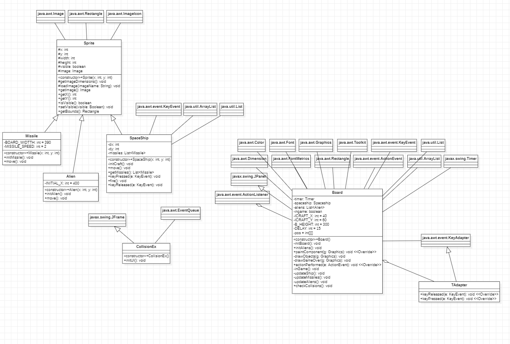

# Collision Detection

## Penjelasan Singkat

Program ini adalah sebuah program singkat yang dapat mendeteksi collision dalam sebuah permainan.

# Penjelasan Class

## Penjelasan Sprite

Kelas ini adalah bentuk kasar dari semua objek yang dapat terlihat di game tersebut. Attribute - attribute yang dimiliki oleh class ini yaitu:

- X dan Y yaitu posisi dari sprite itu sendiri.
- Width dan Height yaitu dimensi dari sprite yang akan digunakan.
- Visible yaitu terlihat atau tidak sprite tersebut.
- Image yaitu file yang akan dijadikan sprite gamenya.

Ada beberapa fungsi yang di ada di class tersebut yaitu

- Fungsi Getter
  - getImageDimensions
  - getImage
  - getX
  - getY
  - isVisible
- Fungsi Setter
  - setVisible
- Fungsi getBounds
  Fungsi ini mencari bounds dari sprite tersebut.
- Fungsi loadImage
  Fungsi ini mengload image yang akan dijadikan sprite.

Class ini juga memiliki satu constructor untuk membuat sebuah sprite.

## Penjelasan Alien

Alien merupakan salah satu sprite game, ia memiliki attribute INITIAL_X = 400 agar alien yang sudah melewati board akan balik ke kanan board lagi.
Alien punya constructor untuk menginisialisasi objek tersebut.

- Fungsi initAlien
  Saat menginisialisasi alien dengan fungsi initAlien(), sprite alien langsung diload dari library.
- Fungsi move
  Diperuntukan untuk menggerakan alien ke kiri, dan jika alien sudah keluar dari play area, alien akan balik ke kiri dengan bantuan INITIAL_X.

